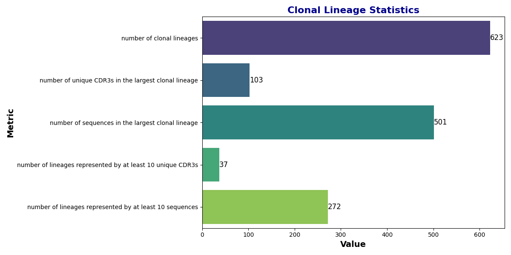
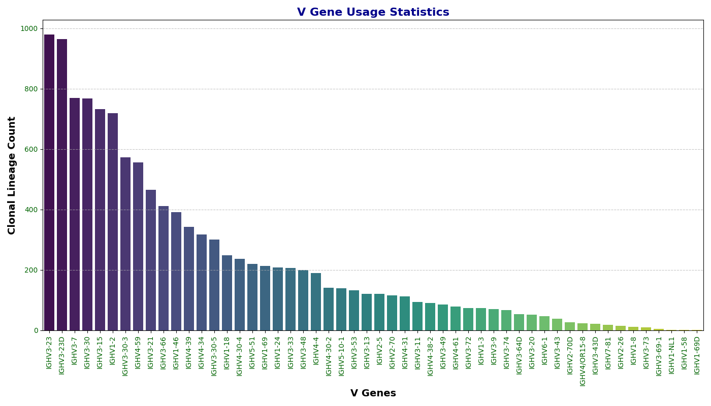
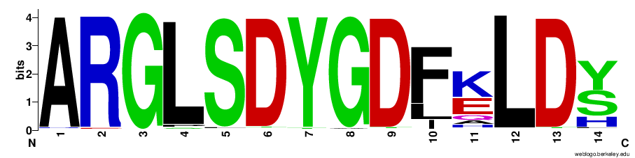

# Clonal Lineage Analysis of Antibody Repertoire Seq Data

**Dohyoung Ko** — Department of Computer Science and Engineering, The Pennsylvania State University

A comprehensive examination of the clonal lineage analysis of antibody repertoire
sequencing data obtained after seasonal influenza vaccination. Germline V, D and J
gene alignments are identified and the CDR3 antigen-binding region of each query
sequence is delineated using NCBI's IgBLAST. Clonal lineages are then deduced by
evaluating the connected components of a Hamming graph constructed from that
analysis.

The repertoire is 10,000 sequences drawn from BioProject PRJNA324093, sampled
after a seasonal influenza vaccination. The original analysis ran on the Cedar
heterogeneous cluster at Simon Fraser University, part of the Advanced Research
Computing service of the Digital Research Alliance of Canada.

---

## Quick start

```bash
make            # build (uses every core)
make check      # unit tests + byte-for-byte check against the frozen results
make run        # analyse the bundled dataset, writing every output to out/
```

The only requirements are `g++` with C++20 and OpenMP, and `make`. There is
nothing to install, no virtualenv, no package manager, and no network access
needed: every dependency is a vendored header under `third_party/`. A clean
build takes about nine seconds.

## Commands

| Command | What it does |
|---|---|
| `make` | Build `build/antibody-repertoire`. Parallel by default. |
| `make test` | 36 unit tests, including the brute-force comparison. |
| `make verify` | Check the output byte-for-byte against `tests/golden/`. |
| `make check` | `test` + `verify`. This is the gate that matters. |
| `make run` | Analyse `data/igblast_results.tsv` into `out/`. |
| `make igblast QUERY=reads.fasta` | FASTA → AIRR TSV, the step before the analysis. |
| `make plot-r` | *Optional.* Extra figures via R, if installed. |
| `make format` | *Optional.* Apply `.clang-format`, if installed. |
| `make compile-commands` | Write `compile_commands.json` for clangd. |
| `make clean` | Remove `build/` and `compile_commands.json`. |
| `make help` | Print the target list. |

Useful variables: `NPROC=2 make` limits build and runtime parallelism,
`OUT=somewhere make run` changes the output directory, and
`IGBLAST_TSV=other.tsv make run` changes the input.

## The two steps

```bash
make igblast QUERY=reads.fasta      # FASTA -> data/igblast_results.tsv
make run                            # TSV  -> statistics, tables and figures
```

IgBLAST is a separate program (bundled in `ncbi-igblast-1.22.0/`) and is needed
whatever the analysis itself is written in. `make run` is the analysis.

Running the binary directly:

```bash
build/antibody-repertoire --igblast data/igblast_results.tsv \
    --dump-lineages out/lineages.tsv \
    --dump-usage    out/v_gene_usage.tsv \
    --weblogo-query out/weblogo_query.txt \
    --usage-plot    out/v_gene_usage.svg \
    --stats-plot    out/lineage_stats.svg \
    --workers 8
```

`--help` lists every flag. `--threshold` sets the Hamming cutoff as a fraction
of CDR3 length (default `0.1`), `--min-lineage-size` the "well represented"
cutoff (default `10`), and `--workers` the thread count (default: chosen from
the size of the job).

The five summary statistics go to **stdout**; logs go to **stderr**. That split is
deliberate — `... > stats.txt` produces a file that diffs directly against the
reference output.

---

## Method

### 1. Reference germline database

VDJ gene matching and CDR3 identification need a reference germline database. It
is built from the IMGT germline sequences at
<http://www.imgt.org/vquest/refseqh.html#VQUEST>, using all pre-annotated V, D and
J sequences for *Homo sapiens*, combined into one file per gene class.

IgBLAST's own utility rewrites IMGT's long definition lines down to germline gene
names, and `makeblastdb` turns each file into a BLAST database:

```bash
bin/edit_imgt_file.pl my_seq_V > my_seq_V
bin/makeblastdb -parse_seqids -dbtype nucl -in my_seq_V
```

Repeated for V, D and J, this produces the three databases under
`ncbi-igblast-1.22.0/database/`, which are bundled here.

### 2. IgBLAST alignment

IgBLAST is run against that database with IMGT domain numbering, emitting AIRR
format (`-outfmt 19`). `make igblast` wraps the invocation; `tools/run_igblast.sh`
holds it.

### 3. Hamming graph

Each **unique CDR3 region is a vertex**. Two CDR3s are joined by an edge when all
three conditions hold:

1. the two CDR3s have equal length;
2. the Hamming distance between their nucleotide sequences is below 10%;
3. they represent VDJ sequences with identical V and J genes.

Gene alleles are ignored in condition 3 — `IGHV1-69*01` and `IGHV1-69*02` are
treated as the same gene. For two nucleotide sequences $A$ and $B$ of equal
length $n$, the Hamming distance is

$$d(A,B) = n - \sum_{i=1}^{n} \delta(A_i, B_i)$$

where $\delta$ is the Kronecker delta.

### 4. Clonal lineages

**Connected components of the Hamming graph are the clonal lineages.** Condition 2
is what makes this robust to sequencing error: because two CDR3s are linked
whenever they differ by less than 10% of their length, a lineage accumulates more
full sequences than it does distinct CDR3s.

---

## Results

### Clonal lineage statistics

| Category | Statistics |
|---|---:|
| Number of clonal lineages | 623 |
| Number of sequences in the largest lineage | 501 |
| Number of unique CDR3s in the largest lineage | 103 |
| Number of lineages with at least 10 unique CDR3s | 37 |
| Number of lineages with at least 10 sequences | 272 |



The gap between 501 sequences and 103 unique CDR3s in the largest lineage is the
sequencing-error tolerance at work: many reads collapse onto near-identical CDR3s
that condition 2 joins into one lineage.

### V gene usage

The $x$-axis is each V gene in the sample; the $y$-axis is the number of reads
carrying it.



The six most-used V genes across all clonal lineages:

| IMGT label | Reads |
|---|---:|
| IGHV3-23 | 979 |
| IGHV3-23D | 964 |
| IGHV3-7 | 769 |
| IGHV3-30 | 768 |
| IGHV3-15 | 732 |
| IGHV1-2 | 719 |

Alleles are not distinguished. These genes encode the V region of the variable
domain of the immunoglobulin heavy chain, which is what participates in antigen
recognition. Most belong to the **IGHV3 family** — IGHV3-23, for instance, sits in
a cluster of roughly 40 functional V genes in the immunoglobulin heavy chain locus
on chromosome 14.

### Amino acid sequences of the largest lineage

A WebLogo plot of the CDR3 amino acid sequences from the largest clonal lineage:



`--weblogo-query` writes the padded, equal-length sequences this is built from.

---

## Implementation

Done naively the graph construction is a quadratic scan — 50 million pairs for a
10,000-read repertoire, and roughly 40 years of compute for the full BioProject.
Three exact reductions bring it down, none of them approximations:

1. **Blocking.** Equal length and shared gene calls are equality constraints, so
   they double as keys: a pair can only be joined if it shares a
   `(length, V, J)` triple.
2. **A pigeonhole filter inside each block.** Two sequences within `d` mismatches
   cannot differ in all of `d + 1` contiguous chunks, so only pairs colliding in a
   chunk index are ever measured.
3. **One canonical block per pair.** A pair whose records share several gene calls
   sits in several blocks; only the block with the smallest key emits it, which
   removes duplicate work at the source rather than deduplicating a finished edge
   list.

Blocks are independent, so the scan is threaded (`--workers`).

### Correctness

The output is discrete — an edge exists or it does not — and a single missing edge
silently merges or splits a lineage with no other symptom. So correctness is
checked two independent ways, both run by `make check`:

- **Against the definition.** `build_edges_reference` compares every pair
  directly, with no blocking, no chunk filter and no canonical-block rule. The
  test suite requires the fast path to agree with it exactly, on generated
  repertoires and on the real 10,000-read dataset (11,294 edges).
- **Against the frozen result.** `tests/golden/` holds output from the original
  Python implementation. `tools/verify_output.sh` requires byte-identical output
  on the real dataset and on a tie-heavy fixture where all 40 lineages have the
  same size — the real dataset cannot catch a tie-breaking bug, because its
  largest lineage is unique. It also asserts the result does not depend on the
  worker count.

Every figure in this README is reproduced exactly by the current code.

### Performance

Against the Python implementation this replaces, same machine, best of three:

| | Python | C++ | |
|---|---|---|---|
| 10,000 reads | 1.17 s, 129 MB | **0.03 s, 61 MB** | 39× |
| 200,000 reads, 1 worker | 18.36 s, 591 MB | **0.72 s, 137 MB** | 25× |
| 200,000 reads, 8 workers | 11.57 s, 628 MB | **0.47 s, 168 MB** | 25× |

Threading has limited headroom left. At 8 workers the run divides into roughly 47%
parsing, 18% collapsing reads to unique CDR3s, 25% the Hamming scan and 9%
union-find — about three quarters serial. The scan, the original bottleneck, no
longer is.

### Continuous integration

`.github/workflows/ci.yml` builds, runs the unit tests, verifies the output
against the frozen reference, rebuilds from clean and performs an end-to-end
run, uploading `out/` as an artifact. There is no dependency-installation step
— a bare Ubuntu image with `g++` is enough.

`verify` is a separate CI step from `test` on purpose: a unit-test failure means
a component broke, while a verify failure means the pipeline's scientific output
changed, which is a much more serious signal and should read as such in the log.

Formatting is **not** gated. `.clang-format` is provided for editors and
`make format`, but the code predates it and has not been normalised against it,
so enforcing it would fail for reasons unrelated to any change.

### Layout

```
Makefile              build, test, run
.github/workflows/    continuous integration
docs/DECISIONS.md     why the code is shaped the way it is
src/                  the analysis
  igblast.*             AIRR TSV loading and normalisation
  hamming.*             blocking, pigeonhole filter, parallel scan, oracle
  lineage.*             union-find, canonical ordering, statistics, WebLogo
  export.*              the TSV dump formats
  svg.*                 bar charts, rendered directly to SVG
  log.*                 a small logger
tests/
  test_main.cpp         unit tests and the brute-force comparison
  golden/               frozen reference output — the port's contract
  data/                 the tie-heavy fixture
third_party/          vendored headers, committed on purpose
tools/                run_igblast.sh, verify_output.sh, plot.R
report/               the write-up this README summarises
data/                 the repertoire, and the IMGT germline reference
ncbi-igblast-1.22.0/  IgBLAST binaries and germline databases (vendored as released)
```

`data/` and `ncbi-igblast-1.22.0/` are marked `linguist-vendored` and
`linguist-generated` in `.gitattributes`, so GitHub's language statistics
describe the code actually written here rather than the bundled release.

### Dependencies, and why there are so few

Committing the headers is what makes `make` work with no network and no package
manager. The cost is third-party code in the repository, so the set is kept small
and every entry has to earn its place:

| Header | Why |
|---|---|
| `csv.hpp` (csv-parser 5.3.0) | AIRR output has 96 columns and needs a real parser. Verified against its published SHA-256. |
| `ankerl/` (unordered_dense 5.0.1) | The scan is hash-map bound; materially faster than `std::unordered_map`. |
| `doctest.h` | Unit tests; not linked into the binary. |

Three things were deliberately **not** adopted:

- **A logging library.** spdlog was used and removed: 1.2 MB of headers and 7.7 s
  of compile time per translation unit, for about eight progress lines.
  `src/log.cpp` replaces it in ~100 lines.
- **A graph library.** Only connected components were ever needed, which is a
  25-line disjoint-set forest. Measured at 157,201 nodes and 1,628,667 edges,
  union-find plus grouping plus the canonical sort is 4.9% of the run. Boost.Graph
  or igraph would be a large dependency to accelerate a twentieth of it.
- **A plotting library.** Matplot++ requires CMake to build and a Gnuplot
  installation at runtime — exactly the kind of dependency this code exists to
  avoid. R and Julia are heavier still: a whole second language runtime, and a
  package manager with it, to draw two bar charts. The figures are bar charts
  and SVG is text, so `src/svg.cpp` writes them directly, inside the same 0.03 s
  run and with nothing to install.

### Optional: figures through R

The pipeline emits its data as TSV, so anything can plot it. `tools/plot.R`
does, and adds a rank-abundance figure the binary does not produce:

```bash
make plot-r        # or: Rscript tools/plot.R out out
```

This is the one target in the build that can fail for want of a tool, and it is
deliberately not a dependency of `run` or `check` — the binary's own SVG output
never needs R. The script uses ggplot2 when it is installed and base graphics
otherwise, so it works against a bare `r-base-core` with no `install.packages()`
step.

### Licence

The code in `src/`, `tests/` and `tools/` is MIT licensed — see `LICENSE`.

Two bundled trees carry their own terms and are **not** covered by it:
`ncbi-igblast-1.22.0/` is redistributed as NCBI released it, under NCBI's
licence, and `third_party/` holds vendored headers under their own licences
(csv-parser, unordered_dense and doctest are each MIT). `data/` contains IMGT
reference sequences, which are subject to IMGT's terms of use.

### Editor setup

`clangd` needs the include paths and the standard, which a Makefile does not
publish:

```bash
make compile-commands
```

`clangd --check` reports two "errors" on a clean tree. They are not compilation
errors: `--check` probes every refactoring action at every token, and
`ExtractFunction` legitimately refuses on `break`/`continue`.
